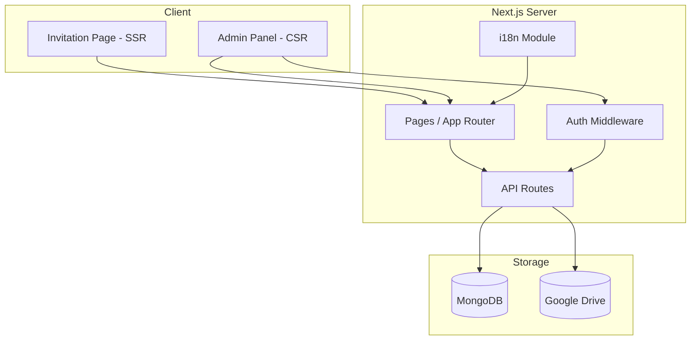

# Design Document: Wedding Invitation Website

## Overview

A single-customer wedding invitation website built with Next.js, MongoDB, and Google Drive. The site presents a single scrollable invitation page for guests, with an admin panel for the couple to manage content. The architecture follows a server-rendered Next.js application with API routes serving as the backend, MongoDB for data persistence, and Google Drive for image storage.

The initial version serves one wedding only. The design keeps data models and API boundaries clean to support future multi-tenant expansion with subdomains.

## Architecture



### Key Architectural Decisions

1. **Next.js App Router with SSR**: The invitation page uses server-side rendering for fast initial load and SEO. The admin panel uses client-side rendering since it's a protected, interactive interface.

2. **API Routes as Backend**: Next.js API routes handle all data operations, avoiding a separate backend service. This simplifies deployment and keeps the stack unified.

3. **Simple Password Auth for Admin**: Since this is a single-customer site, a simple password-based authentication (hashed password stored in environment variable) is sufficient. No user accounts or OAuth needed.

4. **MongoDB for Data**: Flexible schema suits wedding content that may vary. Single collection per entity keeps queries simple.

5. **Google Drive for Images**: Gallery photos and couple photos are stored in Google Drive via the Google Drive API. Files are uploaded to a shared folder and served using Google Drive's direct link format. Next.js Image component serves optimized versions.

6. **i18n with next-intl**: Vietnamese as default language, with optional English toggle. Translations stored in JSON files and wedding content translations stored in MongoDB.

## Components and Interfaces

### Frontend Components

#### Invitation Page (`/`)
- **HeroSection**: Displays couple first names with "-" separator, wedding date, featured photo background. Uses separate desktop (16:9) and mobile (3:4) hero images. Text aligned to bottom with padding.
- **CountdownTimer**: Client component. Calculates remaining time from wedding date. Updates every second. Initializes with zeros to avoid hydration mismatch.
- **CoupleSection**: Displays bride/groom with christian name, full name (lastName + firstName), parent names (father/mother), and photos. Bio field available but currently hidden.
- **EventSection**: First event renders full-width, remaining events render side-by-side in a grid.
- **GallerySection**: Grid of photo thumbnails (5:7 aspect ratio) with lazy loading. Click opens a lightbox overlay with prev/next navigation.
- **RSVPForm**: Form with fields: name (required), attending (required radio), number of attendees (1-10 select, shown when attending), message (optional textarea). Client-side validation + server-side validation. Success message auto-dismisses after 3 seconds. Soft gold (#C9A96E) submit button.
- **WishesSection**: Displays approved wishes in a scrollable container (max 500px height) with infinite scroll lazy loading (5 per page). Includes a submission form (name required, message required). Success message auto-dismisses after 3 seconds. Soft gold submit button.
- **LanguageToggle**: Switches between Vietnamese and English. Only shown when English translations are configured.

#### Admin Panel (`/admin`)
- **LoginForm**: Password input. On success, stores session token in httpOnly cookie.
- **AdminDashboard**: Tabbed interface with sections:
  - **CoupleEditor**: Edit christian names, first/last names, photos, bios, parent names (father/mother), love story.
  - **EventEditor**: Add/edit/remove events with date, time, venue fields.
  - **GalleryManager**: Upload/delete photos. Drag-and-drop upload to Google Drive.
  - **RSVPList**: Table of all RSVPs with name, status, count, message. Read-only.
  - **WishesManager**: List of wishes with delete button for moderation.

### API Routes

| Method | Endpoint | Auth | Description |
|--------|----------|------|-------------|
| GET | `/api/wedding` | No | Get all wedding content (couple, events, gallery URLs) |
| GET | `/api/wishes` | No | Get approved wishes, sorted newest first |
| POST | `/api/rsvp` | No | Submit RSVP |
| POST | `/api/wishes` | No | Submit a wish |
| POST | `/api/admin/login` | No | Authenticate with password, returns session cookie |
| PUT | `/api/admin/wedding` | Yes | Update wedding content |
| POST | `/api/admin/gallery/upload` | Yes | Upload image to Google Drive |
| DELETE | `/api/admin/gallery/:id` | Yes | Delete a gallery photo |
| GET | `/api/admin/rsvps` | Yes | List all RSVPs |
| DELETE | `/api/admin/wishes/:id` | Yes | Delete a wish |

### Auth Middleware

- Validates session token from httpOnly cookie on all `/api/admin/*` routes (except login).
- Session token is a signed JWT with expiration (e.g., 24 hours).
- Password is compared against a bcrypt hash. The hash is stored base64-encoded in `ADMIN_PASSWORD_HASH` environment variable to avoid `$` escaping issues in `.env` files. Decoded at request time before bcrypt comparison.

### i18n Module

- Uses `next-intl` for static UI labels (buttons, headings, form labels).
- Vietnamese locale files at `/messages/vi.json`, English at `/messages/en.json`.
- Wedding content translations (couple bios, event descriptions) stored in MongoDB with `vi` and `en` fields.
- Language preference stored in a cookie, defaults to `vi`.

## Data Models

### MongoDB Collections

#### `wedding` (single document)

```typescript
// Shared base type for all person entities
interface Person {
  firstName: string;
  lastName: string;
  christianName?: string;
}

// Bride/Groom extend Person with profile fields
interface WeddingPerson extends Person {
  photo: string; // Local path or Google Drive URL
  bio: string;
  father?: Person;
  mother?: Person;
}

interface Wedding {
  _id: ObjectId;
  couple: {
    bride: WeddingPerson;
    groom: WeddingPerson;
    loveStory: string;
  };
  heroPhoto: string; // Desktop hero image (16:9)
  heroPhotoMobile?: string; // Mobile hero image (3:4)
  weddingDate: Date;
  events: Array<{
    _id: ObjectId;
    title: string;
    date: Date;
    time: string;
    venueName: string;
    venueAddress: string;
  }>;
  gallery: Array<{
    _id: ObjectId;
    url: string; // Full-size image URL
    thumbnailUrl: string; // Thumbnail URL
    driveFileId?: string; // Google Drive file ID (for deletion)
    order: number;
  }>;
  translations?: {
    en?: {
      couple?: {
        bride?: { firstName?: string; lastName?: string; bio?: string };
        groom?: { firstName?: string; lastName?: string; bio?: string };
        loveStory?: string;
      };
      events?: Array<{
        _id: ObjectId;
        title?: string;
        venueName?: string;
        venueAddress?: string;
      }>;
    };
  };
  createdAt: Date;
  updatedAt: Date;
}
```

#### `rsvps`

```typescript
interface RSVP {
  _id: ObjectId;
  name: string;
  attending: boolean;
  numberOfAttendees: number; // 1-10, 0 when not attending
  message?: string;
  createdAt: Date;
}
```

#### `wishes`

```typescript
interface Wish {
  _id: ObjectId;
  name: string;
  message: string;
  approved: boolean; // default true, set to false when soft-deleted by admin
  createdAt: Date;
}
```

### Validation Rules

| Field | Rule |
|-------|------|
| RSVP name | Required, non-empty string, max 100 chars |
| RSVP attending | Required, boolean |
| RSVP numberOfAttendees | Required when attending=true, integer 1-10 |
| RSVP message | Optional, max 500 chars |
| Wish name | Required, non-empty string, max 100 chars |
| Wish message | Required, non-empty string, max 1000 chars |


## Correctness Properties

*A property is a characteristic or behavior that should hold true across all valid executions of a system — essentially, a formal statement about what the system should do. Properties serve as the bridge between human-readable specifications and machine-verifiable correctness guarantees.*

### Property 1: Countdown timer computes correct remaining time

*For any* wedding date in the future and any current timestamp, the countdown timer should produce days, hours, minutes, and seconds values that, when added back to the current timestamp, equal the wedding date (within 1 second tolerance).

**Validates: Requirements 1.3**

### Property 2: Couple section renders all provided data

*For any* couple data (bride name, bride photo, bride bio, groom name, groom photo, groom bio, love story), rendering the CoupleSection component should produce output containing all seven provided values.

**Validates: Requirements 2.1, 2.2, 2.3**

### Property 3: Event section renders all events with complete details

*For any* list of N events (each with title, date, time, venue name, venue address), the EventSection should render N event cards, and each card should contain the event's date, time, venue name, and address.

**Validates: Requirements 3.1, 3.2**

### Property 4: Venue address links to Google Maps

*For any* venue address string, the rendered event card should contain a link whose href includes `maps.google.com` and the URL-encoded venue address.

**Validates: Requirements 3.3**

### Property 5: Lightbox navigation wraps correctly

*For any* gallery of N photos (N > 0) and any current index i (0 ≤ i < N), clicking next should show the photo at index (i + 1) % N, and clicking previous should show the photo at index (i - 1 + N) % N.

**Validates: Requirements 4.3**

### Property 6: RSVP submission round-trip

*For any* valid RSVP data (non-empty name, boolean attending, attendees 1-10, optional message), submitting it via the POST `/api/rsvp` endpoint and then querying the admin RSVPs list should return an entry matching the submitted data.

**Validates: Requirements 5.2**

### Property 7: Form submission validation rejects invalid payloads

*For any* RSVP payload missing the name or attending field, or any wish payload missing the name or message field (including whitespace-only strings), the respective API endpoint should return HTTP 400 with field-level error details identifying the invalid fields.

**Validates: Requirements 5.3, 6.3, 8.5**

### Property 8: Wishes are filtered to approved only and sorted newest-first

*For any* set of wishes in the database (mix of approved=true and approved=false), the GET `/api/wishes` endpoint should return only wishes where approved=true, and the results should be sorted by createdAt in descending order.

**Validates: Requirements 6.1**

### Property 9: Wish submission round-trip

*For any* valid wish data (non-empty name and non-empty message), submitting it via POST `/api/wishes` and then querying the wishes list should return an entry with matching name and message.

**Validates: Requirements 6.2**

### Property 10: Authentication correctness

*For any* password string, the login endpoint should return a valid session token if and only if the password matches the stored admin password hash. Any non-matching password should result in an authentication failure.

**Validates: Requirements 7.3, 7.4**

### Property 11: Wedding content update round-trip

*For any* valid wedding content update (couple info, event details), submitting it via the authenticated PUT `/api/admin/wedding` endpoint and then reading via GET `/api/wedding` should return data matching the update.

**Validates: Requirements 7.5**

### Property 12: Admin RSVPs list returns all submissions

*For any* set of N RSVP records in the database, the authenticated GET `/api/admin/rsvps` endpoint should return exactly N records, each containing name, attending status, number of attendees, and message.

**Validates: Requirements 7.6**

### Property 13: Deleting a wish excludes it from public listing

*For any* wish in the database, after an authenticated DELETE request to `/api/admin/wishes/:id`, that wish should no longer appear in the GET `/api/wishes` response.

**Validates: Requirements 7.7**

### Property 14: Language toggle visibility depends on translation configuration

*For any* wedding configuration, the language toggle should be rendered if and only if English translations are present in the wedding data.

**Validates: Requirements 10.2**

### Property 15: Language switching renders correct translations

*For any* supported language (Vietnamese or English) and any set of translation keys, switching to that language should cause all UI labels to match the values from that language's translation data.

**Validates: Requirements 10.3**

## Error Handling

### Client-Side Errors

| Scenario | Handling |
|----------|----------|
| RSVP form validation failure | Display inline error messages next to invalid fields. Do not submit to server. |
| Wish form validation failure | Display inline error messages. Do not submit to server. |
| API request failure (network) | Display a toast/banner: "Something went wrong. Please try again." with a retry option. |
| Image load failure | Display a placeholder image with alt text. |
| Admin login failure | Display "Invalid password" message below the password field. |

### Server-Side Errors

| Scenario | HTTP Status | Response |
|----------|-------------|----------|
| Invalid request payload | 400 | `{ error: "Validation failed", fields: { [fieldName]: "error message" } }` |
| Unauthenticated admin request | 401 | `{ error: "Authentication required" }` |
| Invalid session token | 401 | `{ error: "Session expired" }` |
| Resource not found | 404 | `{ error: "Not found" }` |
| Database connection failure | 503 | `{ error: "Service temporarily unavailable" }` |
| Google Drive upload failure | 502 | `{ error: "File upload failed" }` |
| Unexpected server error | 500 | `{ error: "Internal server error" }` |

### Error Handling Patterns

- All API routes wrap handlers in try/catch. Database errors map to 503, unknown errors to 500.
- Client forms use optimistic UI: disable submit button during request, re-enable on failure.
- The admin panel shows error toasts for failed operations with the specific error message from the API.
- Google Drive upload errors are caught and surfaced to the admin with a "retry upload" option.

## Testing Strategy

### Unit Tests

Unit tests cover specific examples, edge cases, and integration points:

- **Component rendering**: Verify each section renders with sample data (HeroSection, CoupleSection, EventSection, etc.)
- **Countdown timer edge cases**: Wedding date in the past (should show zeros), wedding date exactly now
- **Form validation**: Specific invalid inputs (empty string, whitespace-only, exceeding max length)
- **API route handlers**: Mock MongoDB, test each endpoint with valid/invalid payloads
- **Auth middleware**: Test with valid token, expired token, missing token, malformed token
- **i18n**: Default language is Vietnamese, toggle appears/disappears based on config
- **Lightbox**: Open on click, close on escape/overlay click, navigation at boundaries
- **Database error handling**: Mock connection failure, verify 503 response

### Property-Based Tests

Property-based tests verify universal properties across randomized inputs. Use **fast-check** as the PBT library for JavaScript/TypeScript.

Each property test:
- Runs a minimum of 100 iterations
- References its design document property with a tag comment
- Uses fast-check arbitraries to generate random valid and invalid inputs

**Property test mapping:**

| Property | Test Description | Generator Strategy |
|----------|-----------------|-------------------|
| Property 1 | Countdown computation | Random future dates, random current timestamps |
| Property 2 | Couple section data completeness | Random strings for names, URLs, bios |
| Property 3 | Event section rendering | Random arrays of 1-5 events with random field values |
| Property 4 | Maps link correctness | Random address strings including special characters |
| Property 5 | Lightbox navigation | Random gallery sizes (1-50), random starting indices |
| Property 6 | RSVP round-trip | Random valid RSVP payloads |
| Property 7 | Validation rejection | Random payloads with missing/empty required fields |
| Property 8 | Wishes filtering and sorting | Random wish arrays with mixed approved status and dates |
| Property 9 | Wish round-trip | Random valid wish payloads |
| Property 10 | Auth correctness | Random password strings |
| Property 11 | Wedding content round-trip | Random valid wedding content objects |
| Property 12 | Admin RSVP completeness | Random sets of RSVP records |
| Property 13 | Wish deletion exclusion | Random wish, delete, verify absence |
| Property 14 | Language toggle visibility | Random wedding configs with/without translations |
| Property 15 | Language switching | Random language selection, verify label matching |

**Tag format example:**
```typescript
// Feature: wedding-invitation, Property 1: Countdown timer computes correct remaining time
test.prop("countdown computes correct remaining time", [futureDate, currentTimestamp], ([weddingDate, now]) => {
  // ...
});
```

### Test Tools

- **Vitest** for test runner
- **fast-check** for property-based testing
- **React Testing Library** for component tests
- **MSW (Mock Service Worker)** for API mocking in integration tests
